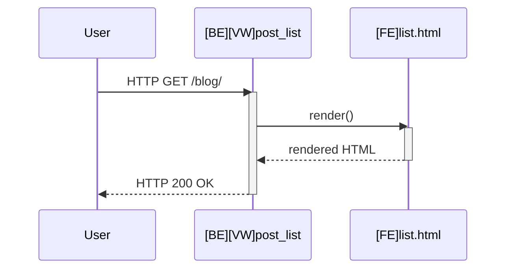
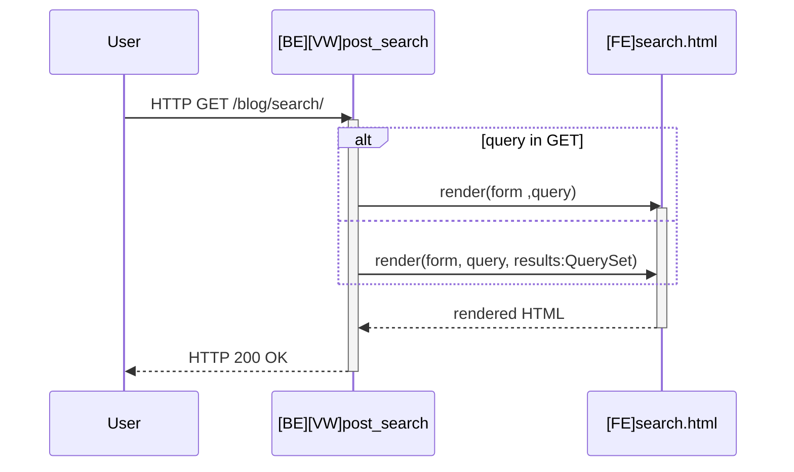
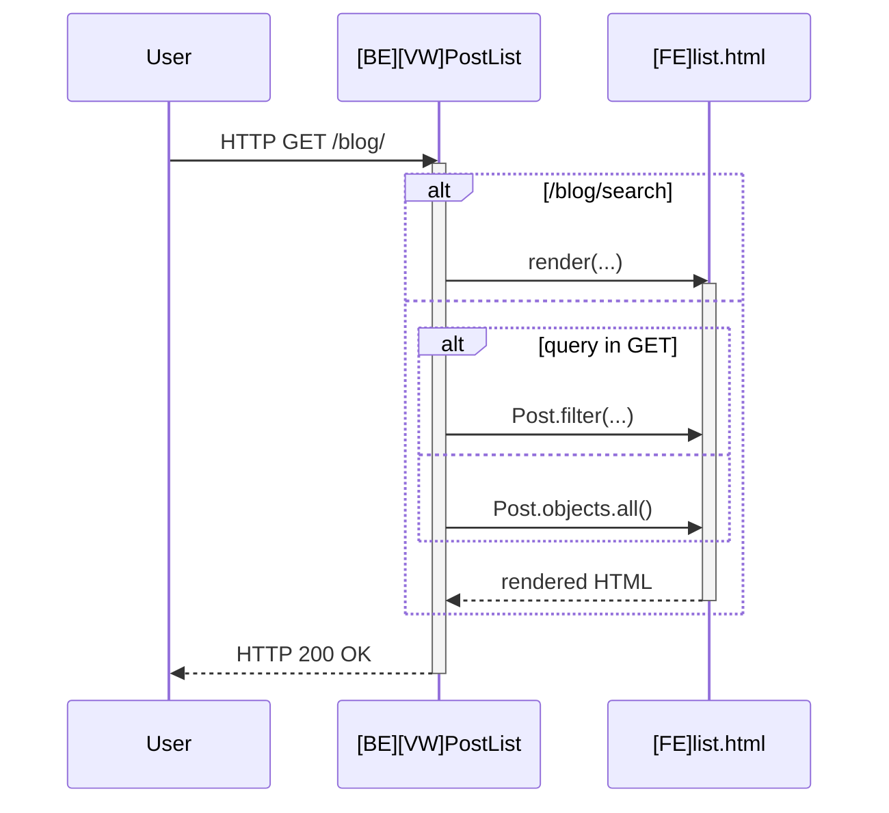

# Before
## Blog Home

```mermaid    
sequenceDiagram
    participant user as User
    participant pl as [BE][VW]post_list
    participant li as [FE]list.html

    user ->> pl: HTTP GET /blog/
    activate pl
    pl ->> li: render()
    activate li
    li -->> pl: rendered HTML
    deactivate li
    pl -->> user: HTTP 200 OK
    deactivate pl
```

## Blog Search

```mermaid
sequenceDiagram
    participant user as User
    participant p_sch as [BE][VW]post_search
    participant sch as [FE]search.html

    user ->> p_sch: HTTP GET /blog/search/
    activate p_sch
    
    alt query in GET
        p_sch ->> sch: render(form ,query)
        activate sch
    else
        p_sch ->> sch: render(form, query, results:QuerySet)
    end
    sch -->> p_sch: rendered HTML
    deactivate sch
    p_sch -->> user: HTTP 200 OK
    deactivate p_sch
```

# After moving search bar into home page. 
## Blog Home & Search

```mermaid    
sequenceDiagram
    participant user as User
    participant pl as [BE][VW]PostList
    participant li as [FE]list.html

    user ->> pl: HTTP GET /blog/
    activate pl
    alt /blog/search
        pl ->> li: render(...)
        activate li
    else
        alt query in GET
            pl ->> li: Post.filter(...)
        else
            pl ->> li: Post.objects.all()
        end
        li -->> pl: rendered HTML
        deactivate li
    end
    pl -->> user: HTTP 200 OK
    deactivate pl
```